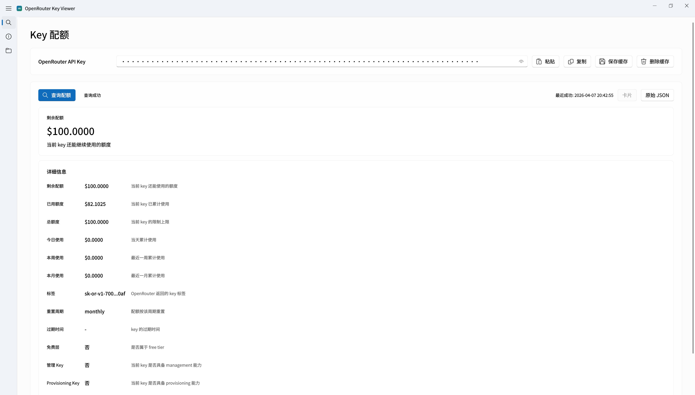

# OpenRouter Key Viewer

一个基于 [uv](https://docs.astral.sh/uv/)、[PySide6-Fluent-Widgets](https://qfluentwidgets.com/) 和 [OpenRouter](https://openrouter.ai/) 的桌面查询工具，用于查看 API Key 配额、账户余额和本地配置。



> [!WARNING]
> 保存后的 `OpenRouter API Key`、`OpenRouter Management Key` 和 `Webhook URL` 会以明文写入本地 `~/.config/open-router-key-viewer/config.json`。
> 如果设备由多人共用，或你不希望敏感信息落盘，请不要点击保存。

## 功能

- 查询能力
  - 查询 `OpenRouter API Key` 的当前配额
  - 查询 `OpenRouter Management Key` 的账户余额
  - 支持卡片视图与原始 HTTP 请求/响应视图切换
- 本地配置
  - 支持本地保存和管理已缓存的 key 与配置
  - 启动时自动加载已有配置文件
- 悬浮小窗
  - 支持仅展示剩余配额、账户余额和最近刷新时间的小窗
  - 支持小窗内手动刷新、置顶切换和返回主窗口
  - 仅在 `X11/xcb` 启动时可用
- GNOME 顶栏指示器
  - 在 GNOME 顶栏显示滚动的配额和余额数据（每 4 秒轮转）
  - 通过 D-Bus StatusNotifierItem 协议实现，无额外依赖
  - 右键菜单支持刷新、打开主窗口和退出
  - Ubuntu 开箱即用，其他发行版需安装 AppIndicator 扩展
  - 在配置页面手动开启，支持运行时动态切换
- 自动化与监控
  - 支持启动自动查询
  - 支持按秒配置定时自动查询
  - 支持阈值告警
  - 支持应用内通知、系统通知和 Webhook

## 运行

先安装依赖：

```bash
uv sync
```

直接运行：

```bash
uv run python -m open_router_key_viewer
```

或：

```bash
./scripts/run.sh
```

如果需要使用悬浮小窗，请用 `X11/xcb` 方式启动：

```bash
QT_QPA_PLATFORM=xcb ./scripts/run.sh
```

当前规则：

- 普通主界面可在默认方式下运行
- 悬浮小窗仅在 `X11/xcb` 启动时支持
- `Wayland` 下可使用 GNOME 顶栏指示器替代悬浮小窗（需在配置页面开启）

## 本地配置

```bash
~/.config/open-router-key-viewer
```

行为约定：

- 软件启动时如果找到配置文件，会自动加载
- 如果找不到配置文件，不会自动创建
- key 默认不会自动保存，只有点击保存按钮时才会以明文写入本地
- `Webhook URL` 等本地配置项同样以明文写入 `config.json`
- 配置页可以删除 `config.json`，也可以删除整个配置目录

## 页面

### Key 配额
- 剩余配额
- 已用额度
- 总额度
- 今日使用
- 本周使用
- 本月使用
- 标签
- 重置周期
- 过期时间
- 免费层
- 管理 Key
- Provisioning Key
- 速率限制

### 账户余额
- 剩余余额
- 总余额
- 已用余额

### 原始视图
- request method
- request url
- masked request headers
- response status code
- response headers
- response body

### 配置
- 缓存目录和配置文件状态查看
- 删除配置文件
- 删除整个缓存目录
- 查看已解析配置
- 查看原始配置文件内容
- 打开悬浮小窗（仅 `X11/xcb`）
- 顶栏指示器开关（需环境支持 StatusNotifierItem）
- 启动时自动查询 `Key 配额`
- 启动时自动查询 `账户余额`
- 定时查询开关和轮询间隔
- Warning / Critical 阈值设置
- 应用内通知开关
- 系统通知开关
- `Key 配额` Webhook 开关、仅 Critical 开关、Webhook URL
- `账户余额` Webhook 开关、仅 Critical 开关、Webhook URL

## 告警
- 应用内 `InfoBar` 为常驻提示，需要手动关闭
- 系统通知会显示应用名 `OpenRouter Key Viewer`
- 告警会带上具体监控对象
- 同一等级不会重复连续提示，恢复正常后才会重新进入下一轮告警

## 打包发布

项目目前保留 PyInstaller `onefile` 打包方式。

如果使用发布脚本，还需要系统里有 ImageMagick 的 `convert`，用于从 SVG 生成图标。

直接打包：

```bash
uv run pyinstaller open_router_key_viewer.spec --noconfirm --clean
```

产物位置：

```bash
dist/open-router-key-viewer
```

也可以使用脚本：

```bash
./scripts/release.sh
```

脚本会：

- 清理旧的 `build/` 和 `dist/`
- 生成打包所需图标
- 执行 `PyInstaller onefile` 打包

## License

MIT
